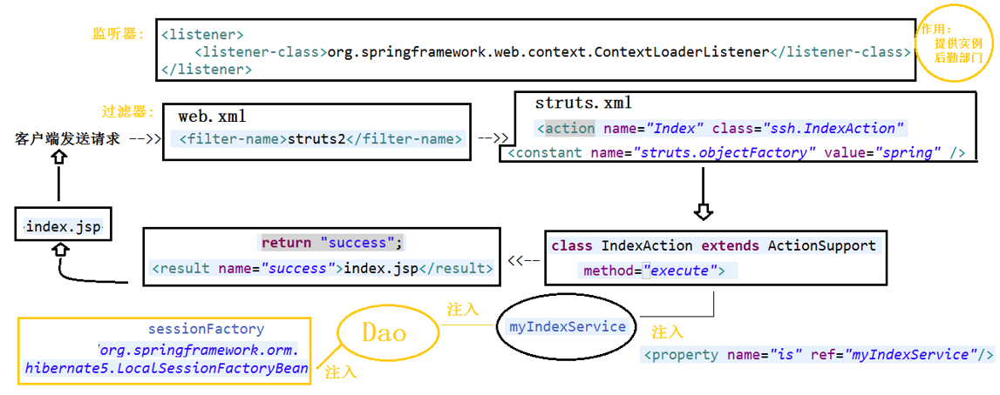

## SSH框架

#### struts
1、什么是struts2：  
Struts2是一个基于MVC设计模式的Web应用框架，它本质上相当于一个servlet，在MVC设计模式中，Struts2作为控制器(Controller)来建立模型与视图的数据交互。Struts 2是Struts的下一代产品，是在 struts 1和WebWork的技术基础上进行了合并的全新的Struts 2框架。其全新的Struts 2的体系结构与Struts 1的体系结构差别巨大。Struts 2以WebWork为核心，采用拦截器的机制来处理用户的请求，这样的设计也使得业务逻辑控制器能够与ServletAPI完全脱离开，所以Struts 2可以理解为WebWork的更新产品。虽然从Struts 1到Struts 2有着太大的变化，但是相对于WebWork，Struts 2的变化很小。  

2、struts2框架的运行结构：  

解析：客户端发送请求(HttpServletRequest)到服务器，服务器接收到请求就先进入web.xml配置文件看看有没有配置过滤器，发现有struts2的过滤器，然后就找到struts.xml配置文件，struts.xml配置文件里有定义一个action，然后就去找到类名叫IndexAction这个类(此action类必须是继承ActionSupport接口)，并且实现了execute()方法，返回一个字符串为"success"给struts.xml配置文件，struts.xml配置文件的action会默认调用IndexAction类的execute()方法，result接收到了返回的字符串，然后查找结果字符串对应的(Result），result就会调用你指定的jsp页面将结果呈现，最后响应回给客户端。  

#### spring
1、什么是spring?  
Spring是一个轻量级控制反转(IoC)和面向切面(AOP)的容器框架。    
轻量——从大小与开销两方面而言Spring都是轻量的。完整的Spring框架可以在一个大小只有1MB多的JAR文件里发布。并且Spring所需的处理开销也是微不足道的。此外，Spring是非侵入式的：典型地，Spring应用中的对象不依赖于Spring的特定类。   
控制反转——Spring通过一种称作控制反转（IoC）的技术促进了松耦合。当应用了IoC，一个对象依赖的其它对象会通过被动的方式传递进来，而不是这个对象自己创建或者查找依赖对象。你可以认为IoC与JNDI相反——不是对象从容器中查找依赖，而是容器在对象初始化时不等对象请求就主动将依赖传递给它。  
面向切面——Spring提供了面向切面编程的丰富支持，允许通过分离应用的业务逻辑与系统级服务（例如审计（auditing）和事务（transaction）管理）进行内聚性的开发。应用对象只实现它们应该做的——完成业务逻辑——仅此而已。它们并不负责（甚至是意识）其它的系统级关注点，例如日志或事务支持。    
容器——Spring包含并管理应用对象的配置和生命周期，在这个意义上它是一种容器，你可以配置你的每个bean如何被创建——基于一个可配置原型（prototype），你的bean可以创建一个单独的实例或者每次需要时都生成一个新的实例——以及它们是如何相互关联的。然而，Spring不应该被混同于传统的重量级的EJB容器，它们经常是庞大与笨重的，难以使用。  
框架——Spring可以将简单的组件配置、组合成为复杂的应用。在Spring中，应用对象被声明式地组合，典型地是在一个XML文件里。Spring也提供了很多基础功能（事务管理、持久化框架集成等等），将应用逻辑的开发留给了你。  

2、spring的流程图：  
 

解析：上图是在struts结构图的基础上加入了spring流程图，在web.xml配置文件中加入了spring的监听器，在struts.xml配置文件中添加“<constant name="struts.objectFactory" value="spring" />”是告知Struts2运行时使用Spring来创建对象，spring在其中主要做的就是注入实例，将所有需要类的实例都由spring管理。  

#### hibernate

#### 参考
[SSH框架搭建和整合(struts2、spring4、hibernate5)](https://www.cnblogs.com/laibin/p/5847111.html)  
[为什么要放弃ssh框架](https://www.cnblogs.com/hackxiyu/p/6849085.html)     

