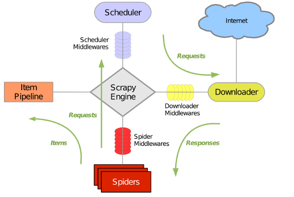
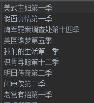

##  Python爬虫

### Scrapy
Scrapy是一个为了爬取网站数据，提取结构性数据而编写的应用框架。 其可以应用在数据挖掘，信息处理或存储历史数据等一系列的程序中。其最初是为了页面抓取 (更确切来说, 网络抓取 )所设计的， 也可以应用在获取API所返回的数据(例如 Amazon Associates Web Services ) 或者通用的网络爬虫。Scrapy用途广泛，可以用于数据挖掘、监测和自动化测试。  

Scrapy 使用了 Twisted异步网络库来处理网络通讯。整体架构大致如下  

Scrapy主要包括了以下组件：  

引擎(Scrapy)  
用来处理整个系统的数据流, 触发事务(框架核心)  
调度器(Scheduler)  
用来接受引擎发过来的请求, 压入队列中, 并在引擎再次请求的时候返回. 可以想像成一个URL（抓取网页的网址或者说是链接）的优先队列, 由它来决定下一个要抓取的网址是什么, 同时去除重复的网址  
下载器(Downloader)  
用于下载网页内容, 并将网页内容返回给蜘蛛(Scrapy下载器是建立在twisted这个高效的异步模型上的)  
爬虫(Spiders)  
爬虫是主要干活的, 用于从特定的网页中提取自己需要的信息, 即所谓的实体(Item)。用户也可以从中提取出链接,让Scrapy继续抓取下一个页面  
项目管道(Pipeline)  
负责处理爬虫从网页中抽取的实体，主要的功能是持久化实体、验证实体的有效性、清除不需要的信息。当页面被爬虫解析后，将被发送到项目管道，并经过几个特定的次序处理数据。  
下载器中间件(Downloader Middlewares)  
位于Scrapy引擎和下载器之间的框架，主要是处理Scrapy引擎与下载器之间的请求及响应。  
爬虫中间件(Spider Middlewares)  
介于Scrapy引擎和爬虫之间的框架，主要工作是处理蜘蛛的响应输入和请求输出。  
调度中间件(Scheduler Middewares)  
介于Scrapy引擎和调度之间的中间件，从Scrapy引擎发送到调度的请求和响应。  
Scrapy运行流程大概如下：  

引擎从调度器中取出一个链接(URL)用于接下来的抓取  
引擎把URL封装成一个请求(Request)传给下载器  
下载器把资源下载下来，并封装成应答包(Response)  
爬虫解析Response  
解析出实体（Item）,则交给实体管道进行进一步的处理  
解析出的是链接（URL）,则把URL交给调度器等待抓取  
 
一、安装
```
1、安装wheel
pip install wheel
2、安装lxml
https://pypi.python.org/pypi/lxml/4.1.0
3、安装pyopenssl
https://pypi.python.org/pypi/pyOpenSSL/17.5.0
4、安装Twisted
https://www.lfd.uci.edu/~gohlke/pythonlibs/
5、安装pywin32
https://sourceforge.net/projects/pywin32/files/
6、安装scrapy
pip install scrapy
```
 注：windows平台需要依赖pywin32，请根据自己系统32/64位选择下载安装，https://sourceforge.net/projects/pywin32/  
 
二、爬虫举例

入门篇：美剧天堂前100最新（http://www.meijutt.com/new100.html）

1、创建工程
```
scrapy startproject movie
```
2、创建爬虫程序
```
cd movie
scrapy genspider meiju meijutt.com
```

3、自动创建目录及文件  


4、文件说明：
* scrapy.cfg  项目的配置信息，主要为Scrapy命令行工具提供一个基础的配置信息。（真正爬虫相关的配置信息在settings.py文件中）   
* items.py    设置数据存储模板，用于结构化数据，如：Django的Model  
* pipelines    数据处理行为，如：一般结构化的数据持久化  
* settings.py 配置文件，如：递归的层数、并发数，延迟下载等  
* spiders      爬虫目录，如：创建文件，编写爬虫规则  

注意：一般创建爬虫文件时，以网站域名命名

5、设置数据存储模板  
items.py
```
import scrapy

class MovieItem(scrapy.Item):
    # define the fields for your item here like:
    # name = scrapy.Field()
    name = scrapy.Field()    
```
6、编写爬虫  
meiju.py
```
# -*- coding: utf-8 -*-
import scrapy
from movie.items import MovieItem
 
class MeijuSpider(scrapy.Spider):
    name = "meiju"
    allowed_domains = ["meijutt.com"]
    start_urls = ['http://www.meijutt.com/new100.html']
 
    def parse(self, response):
        movies = response.xpath('//ul[@class="top-list  fn-clear"]/li')
        for each_movie in movies:
            item = MovieItem()
            item['name'] = each_movie.xpath('./h5/a/@title').extract()[0]
            yield item
 
```
7、设置配置文件  
settings.py增加如下内容
```
ITEM_PIPELINES = {'movie.pipelines.MoviePipeline':100}
```
8、编写数据处理脚本  
pipelines.py
```
class MoviePipeline(object):
    def process_item(self, item, spider):
        with open("my_meiju.txt",'a') as fp:
            fp.write(item['name'].encode("utf8") + '\n')
```
9、执行爬虫
```
cd movie
scrapy crawl meiju --nolog
``` 

10、结果  



#### 进阶篇：爬取校花网（http://www.xiaohuar.com/list-1-1.html）

1、创建一个工程
```
scrapy startproject pic
``` 

2、创建爬虫程序
```
cd pic
scrapy genspider xh xiaohuar.com
``` 

3、自动创建目录及文件


4、文件说明：  
* scrapy.cfg  项目的配置信息，主要为Scrapy命令行工具提供一个基础的配置信息。（真正爬虫相关的配置信息在settings.py文件中）
* items.py    设置数据存储模板，用于结构化数据，如：Django的Model
* pipelines    数据处理行为，如：一般结构化的数据持久化
* settings.py 配置文件，如：递归的层数、并发数，延迟下载等
* spiders      爬虫目录，如：创建文件，编写爬虫规则
注意：一般创建爬虫文件时，以网站域名命名

5、设置数据存储模板
```
import scrapy
 
class PicItem(scrapy.Item):
    # define the fields for your item here like:
    # name = scrapy.Field()
    addr = scrapy.Field()
    name = scrapy.Field()
``` 

 6、编写爬虫
```
# -*- coding: utf-8 -*-
import scrapy
import os
# 导入item中结构化数据模板
from pic.items import PicItem
 
class XhSpider(scrapy.Spider):
    # 爬虫名称，唯一
    name = "xh"
    # 允许访问的域
    allowed_domains = ["xiaohuar.com"]
    # 初始URL
    start_urls = ['http://www.xiaohuar.com/list-1-1.html']
 
    def parse(self, response):
        # 获取所有图片的a标签
        allPics = response.xpath('//div[@class="img"]/a')
        for pic in allPics:
            # 分别处理每个图片，取出名称及地址
            item = PicItem()
            name = pic.xpath('./img/@alt').extract()[0]
            addr = pic.xpath('./img/@src').extract()[0]
            addr = 'http://www.xiaohuar.com'+addr
            item['name'] = name
            item['addr'] = addr
            # 返回爬取到的数据
            yield item
 
```

7、设置配置文件  
```
# 设置处理返回数据的类及执行优先级
ITEM_PIPELINES = {'pic.pipelines.PicPipeline':100}
``` 

8、编写数据处理脚本   
```
import urllib2
import os
 
class PicPipeline(object):
    def process_item(self, item, spider):
        headers = {'User-Agent': 'Mozilla/5.0 (Windows NT 6.1; WOW64; rv:52.0) Gecko/20100101 Firefox/52.0'}
        req = urllib2.Request(url=item['addr'],headers=headers)
        res = urllib2.urlopen(req)
        file_name = os.path.join(r'D:\my\down_pic',item['name']+'.jpg')
        with open(file_name,'wb') as fp:
            fp.write(res.read())
```

 9、执行爬虫
```
cd pic
scrapy crawl xh --nolog
``` 

结果：


 

#### 终极篇：我想要所有校花图

注明：基于进阶篇再修改为终极篇

```
#　　xh.py

# -*- coding: utf-8 -*-
import scrapy
import os
from scrapy.http import Request
 
# 导入item中结构化数据模板
from pic.items import PicItem
 
class XhSpider(scrapy.Spider):
    # 爬虫名称，唯一
    name = "xh"
    # 允许访问的域
    allowed_domains = ["xiaohuar.com"]
    # 初始URL
    start_urls = ['http://www.xiaohuar.com/hua/']
    # 设置一个空集合
    url_set = set()
 
    def parse(self, response):
        # 如果图片地址以http://www.xiaohuar.com/list-开头，我才取其名字及地址信息
        if response.url.startswith("http://www.xiaohuar.com/list-"):
            allPics = response.xpath('//div[@class="img"]/a')
            for pic in allPics:
                # 分别处理每个图片，取出名称及地址
                item = PicItem()
                name = pic.xpath('./img/@alt').extract()[0]
                addr = pic.xpath('./img/@src').extract()[0]
                addr = 'http://www.xiaohuar.com'+addr
                item['name'] = name
                item['addr'] = addr
                # 返回爬取到的信息
                yield item
        # 获取所有的地址链接
        urls = response.xpath("//a/@href").extract()
        for url in urls:
            # 如果地址以http://www.xiaohuar.com/list-开头且不在集合中，则获取其信息
            if url.startswith("http://www.xiaohuar.com/list-"):
                if url in XhSpider.url_set:
                    pass
                else:
                    XhSpider.url_set.add(url)
                    # 回调函数默认为parse,也可以通过from scrapy.http import Request来指定回调函数
                    # from scrapy.http import Request
                    # Request(url,callback=self.parse)
                    yield self.make_requests_from_url(url)
            else:
                pass

```

### 参考：

[Scrapy 0.24 文档](https://scrapy-chs.readthedocs.io/zh_CN/0.24/)   
[Scrapy简单入门及实例讲解](http://www.cnblogs.com/kongzhagen/p/6549053.html)  
[scrapy 伪装代理和fake_userAgent的使用](https://www.cnblogs.com/seablog/p/7050552.html)  

[python爬虫设置代理ip池——方法（一）](https://blog.csdn.net/weixin_40372371/article/details/80154707)  
[Python爬虫代理IP（代理池）——加载和使用](https://blog.csdn.net/qq_33472765/article/details/80662917)  