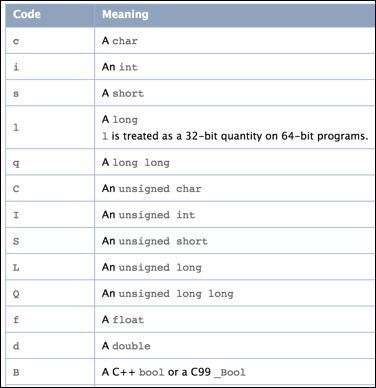
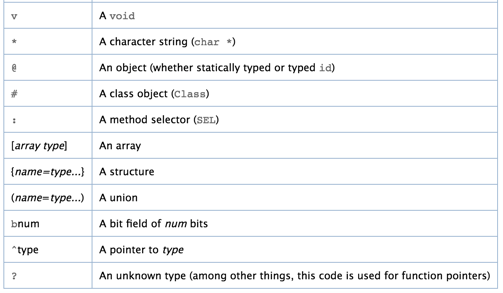
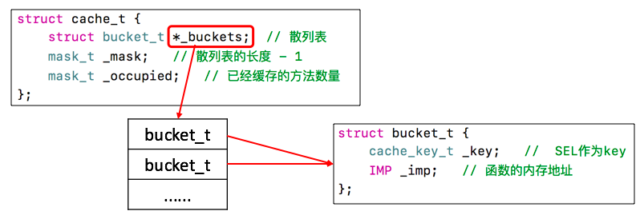
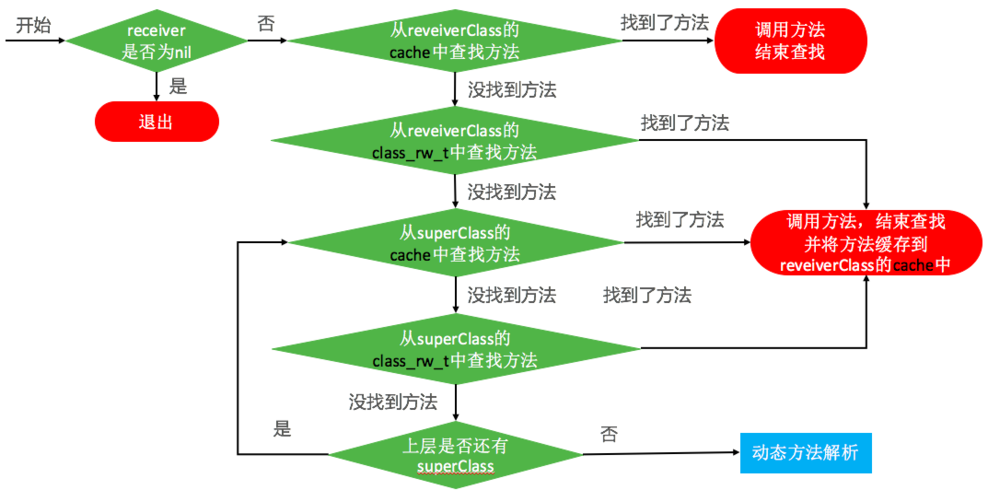
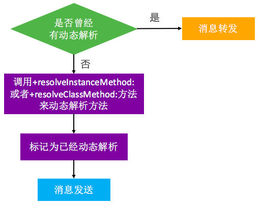
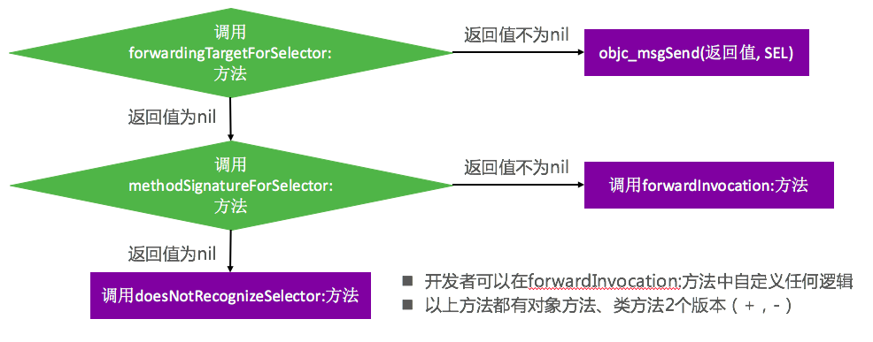

## 深入理解OC-RunTime

* Objective-C是一门动态性比较强的编程语言，跟C、C++等语言有着很大的不同
* Objective-C的动态性是由Runtime API来支撑的
* Runtime API提供的接口基本都是C语言的，源码由C\C++\汇编语言编写
* OC是一门动态性比较强的编程语言，允许很多操作推迟到程序运行时再进行
* OC的动态性就是由Runtime来支撑和实现的，Runtime是一套C语言的API，封装了很多动态性相关的函数
* 平时编写的OC代码，底层都是转换成了Runtime API进行调用

##### 第一部分：isa

###### 前一篇：[iOS-对象、isa和SuperClass](https://www.jianshu.com/p/4ae681091e2a)

* 按位与（&），同为1才为1
* 按位或（|），只要有1就是1
* 按位取反（~），1置为0，0置为1
* 取反运算符（！），判断表达式是否为真，为真取假，为假取真

什么是isa？

在arm64架构之前，isa就是一个普通的指针，存储着Class、Meta-Class对象的内存地址
从arm64架构开始，对isa进行了优化，变成了一个共用体（union）结构，还使用位域来存储更多的信息

```
union isa_t 
{
isa_t() { }
isa_t(uintptr_t value) : bits(value) { }

Class cls;
uintptr_t bits;

# if __arm64__
#   define ISA_MASK        0x0000000ffffffff8ULL
#   define ISA_MAGIC_MASK  0x000003f000000001ULL
#   define ISA_MAGIC_VALUE 0x000001a000000001ULL
struct {
uintptr_t nonpointer        : 1;
uintptr_t has_assoc         : 1;
uintptr_t has_cxx_dtor      : 1;
uintptr_t shiftcls          : 33; // MACH_VM_MAX_ADDRESS 0x1000000000
uintptr_t magic             : 6;
uintptr_t weakly_referenced : 1;
uintptr_t deallocating      : 1;
uintptr_t has_sidetable_rc  : 1;
uintptr_t extra_rc          : 19;
#       define RC_ONE   (1ULL<<45)
#       define RC_HALF  (1ULL<<18)
};
};
```

**isa-位域详解**
* 1.nonpointer
0，代表普通的指针，存储着Class、Meta-Class对象的内存地址
1，代表优化过，使用位域存储更多的信息

* 2.has_assoc
是否有设置过关联对象，如果没有，释放时会更快

* 3.has_cxx_dtor
是否有C++的析构函数（.cxx_destruct），如果没有，释放时会更快

* 4.shiftcls
存储着Class、Meta-Class对象的内存地址信息

* 5.magic
用于在调试时分辨对象是否未完成初始化

* 6.weakly_referenced
是否有被弱引用指向过，如果没有，释放时会更快

* 7.deallocating
对象是否正在释放

* 8.extra_rc
里面存储的值是引用计数器减1

* 9.has_sidetable_rc
引用计数器是否过大无法存储在isa中
如果为1，那么引用计数会存储在一个叫SideTable的类的属性中

###### 释放对象调用的方法
```
/***********************************************************************
* objc_destructInstance
* Destroys an instance without freeing memory. 
* Calls C++ destructors.
* Calls ARC ivar cleanup.
* Removes associative references.
* Returns `obj`. Does nothing if `obj` is nil.
**********************************************************************/
void *objc_destructInstance(id obj) 
{
if (obj) {
// Read all of the flags at once for performance.
bool cxx = obj->hasCxxDtor();
bool assoc = obj->hasAssociatedObjects();

// This order is important.
if (cxx) object_cxxDestruct(obj);
if (assoc) _object_remove_assocations(obj);
obj->clearDeallocating();
}

return obj;
}
```

代码可以看出释放对象回判断是否有C++函数和关联对象，如果有会进一步做释放工作。
##### 知识点：

* Class、meta-class 对象的地址值（二进制）最后2位为000
* 通过isa指针可以知道是否有关联对象、是否被弱引用过

###### Class是结构体结构


Class结构

###### class_rw_t
class_rw_t里面的methods、properties、protocols是二维数组，是可读可写的，包含了类的初始内容、分类的内容


class_rw_t结构

###### class_ro_t
class_ro_t里面的baseMethodList、baseProtocols、ivars、baseProperties是一维数组，是只读的，包含了类的初始内容


class_ro_t结构

#### 第二部分：Runtime-方法
##### Q：简述method_t

method_t是对方法\函数的封装

###### 源码展示：
```
struct method_t {
SEL name;//函数名
const char *types;//编码（返回值类型、参数类型）
IMP imp;//指向函数的指针（函数地址）
}
```

###### 1.SEL

* SEL代表方法\函数名，一般叫做选择器，底层结构跟char *类似
* 可以通过@selector()和sel_registerName()获得
* 可以通过sel_getName()和NSStringFromSelector()转成字符串
* 不同类中相同名字的方法，所对应的方法选择器是相同的

```
typedef struct objc_selector*SEL;
```

###### 2.IMP
IMP代表函数的具体实现

```
typedef id_Nullable (*IMP) (id_Nonnull,SEl_Nonnull,...);
```

###### 3.types
types包含了函数返回值、参数编码的字符串


返回参数

函数类型：
`- (int)test:(int)age height:(float)height;`
types显示内容
`"i24@0:8i16f20"`

types返回内容逐字解释：

* i：表示返回值 int
* @：表示id类型
* “：”：表示SEL
* f：表示 float
* 24：表示总共占中24个字节，id(8)+SEL(8)+int(4)+float(4) = 24
* 0：表示id类型从0字节开始
* 8：表示SEL类型从8字节开始
* 16：表示age（int）参数从16字节开始
* 120：表示height（float）参数从20字节开始

iOS中提供了一个叫做@encode的指令，可以将具体的类型表示成字符串编码，如下：


TypeEncoding编码表

TypeEncoding编码表

##### Q：什么是方法缓存？

Class内部结构中有个方法缓存（cache_t），用`散列表（哈希表）`来缓存曾经调用过的方法，可以提高方法的查找速度。


cache_t结构

##### Q：什么是散列表缓存？

* 在缓存和取值时有个策略：`@selector(personTest) & _mask = 索引值`
根据这种策略把方法缓存到列表中，如果索引值相同就`索引值-1`，如果减少到0，就从`_mask`开始存放
* 在取值时根据这种策略来直接找到索引值，判断该索引值存放的key是否相同，相同取出IMP；不相同，查找`索引值-1 -> 0 ->_mask -> _mask-1 -> ···` 直到找到相同的key，取出IMP
* 优点：牺牲内存空间换取读取时间，效率高
* 一旦数组扩容，就会把缓存清掉，扩容数组容量 = 旧数组容量 * 2
* 可自行参考其他博客查看

### 第三部分：Runtime-objc_msgSend

objc_msgSend执行流程分为三大阶段：消息发送、动态方法解析、消息转发

##### Runtime源码解读流程
```
objc-msg-arm64.s
ENTRY _objc_msgSend
b.le    LNilOrTagged
CacheLookup NORMAL
.macro CacheLookup
.macro CheckMiss
STATIC_ENTRY __objc_msgSend_uncached
.macro MethodTableLookup
__class_lookupMethodAndLoadCache3

objc-runtime-new.mm
_class_lookupMethodAndLoadCache3
lookUpImpOrForward
getMethodNoSuper_nolock、search_method_list、log_and_fill_cache
cache_getImp、log_and_fill_cache、getMethodNoSuper_nolock、log_and_fill_cache
_class_resolveInstanceMethod
_objc_msgForward_impcache

objc-msg-arm64.s
STATIC_ENTRY __objc_msgForward_impcache
ENTRY __objc_msgForward

Core Foundation
__forwarding__（不开源）
```

##### 3.1 消息发送


消息发送执行流程

* receiver通过isa指针找到receiverClass
* receiverClass通过superclass指针找到superClass
* 如果是从class_rw_t中查找方法
1.已经排序的，二分查找
2.没有排序的，遍历查找

##### 3.2 动态解析


动态解析流程

开发者可以实现以下方法，来动态添加方法实现

* +resolveInstanceMethod:添加对象方法
* +resolveClassMethod:添加类方法

动态解析过后，会重新走“消息发送”的流程

* “从receiverClass的cache中查找方法”这一步开始执行

#### Q：Runtime动态添加方法的几种方式？

###### Runtime方式
```
- (void)other{
NSLog(@"%s",__func__);
}
+(BOOL)resolveInstanceMethod:(SEL)sel{
NSLog(@"%s",__func__);
if (sel == @selector(test)) {
Method method = class_getInstanceMethod(self, @selector(other));
//动态添加对象方法，需要给类添加方法
class_addMethod(self, sel, method_getImplementation(method), method_getTypeEncoding(method));
return YES;
}
return [super resolveInstanceMethod:sel];
}
```
OC 方式
```
- (void)other{
NSLog(@"%s",__func__);
}

struct method_t {
SEL sel;
char *types;
IMP imp;
};

+ (BOOL)resolveInstanceMethod:(SEL)sel
{
if (sel == @selector(test)) {
// 获取其他方法
struct method_t *method = (struct method_t *)class_getInstanceMethod(self, @selector(other));

// 动态添加test方法的实现
class_addMethod(self, sel, method->imp, method->types);

// 返回YES代表有动态添加方法
return YES;
}
return [super resolveInstanceMethod:sel];
}
```
C 方法
```
void c_other(id self, SEL _cmd)
{
NSLog(@"c_other - %@ - %@", self, NSStringFromSelector(_cmd));
}

+ (BOOL)resolveInstanceMethod:(SEL)sel
{
if (sel == @selector(test)) {
// 动态添加test方法的实现
class_addMethod(self, sel, (IMP)c_other, "v16@0:8");

// 返回YES代表有动态添加方法
return YES;
}
return [super resolveInstanceMethod:sel];
}
```
动态添加类方法
```
void c_other(id self, SEL _cmd)
{
NSLog(@"c_other - %@ - %@", self, NSStringFromSelector(_cmd));
}

+ (BOOL)resolveClassMethod:(SEL)sel
{
if (sel == @selector(test)) {
// 第一个参数是object_getClass(self)
// 添加类方法 需要传入元类
class_addMethod(object_getClass(self), sel, (IMP)c_other, "v16@0:8");
return YES;
}
return [super resolveClassMethod:sel];
}
```
##### Q：dynamic修饰变量的含义？

@dynamic是告诉编译器不用自动生成getter和setter的实现，等到运行时再添加方法实现
提醒编译器不要自动生成setter和getter的实现、不要自动生成成员变量
```
@interface Person : NSObject
@property (nonatomic, assign) int age;
@end

@implementation Person
@dynamic age;
@end
```
##### 3.3 消息转发

消息转发执行流程

消息转发底层汇编转OC（某位大神制作）
```
int __forwarding__(void *frameStackPointer, int isStret) {
id receiver = *(id *)frameStackPointer;
SEL sel = *(SEL *)(frameStackPointer + 8);
const char *selName = sel_getName(sel);
Class receiverClass = object_getClass(receiver);

// 调用 forwardingTargetForSelector:
if (class_respondsToSelector(receiverClass, @selector(forwardingTargetForSelector:))) {
id forwardingTarget = [receiver forwardingTargetForSelector:sel];
if (forwardingTarget && forwardingTarget != receiver) {
return objc_msgSend(forwardingTarget, sel, ...);
}
}

// 调用 methodSignatureForSelector 获取方法签名后再调用 forwardInvocation
if (class_respondsToSelector(receiverClass, @selector(methodSignatureForSelector:))) {
NSMethodSignature *methodSignature = [receiver methodSignatureForSelector:sel];
if (methodSignature && class_respondsToSelector(receiverClass, @selector(forwardInvocation:))) {
NSInvocation *invocation = [NSInvocation _invocationWithMethodSignature:methodSignature frame:frameStackPointer];

[receiver forwardInvocation:invocation];

void *returnValue = NULL;
[invocation getReturnValue:&value];
return returnValue;
}
}

if (class_respondsToSelector(receiverClass,@selector(doesNotRecognizeSelector:))) {
[receiver doesNotRecognizeSelector:sel];
}

// The point of no return.
kill(getpid(), 9);
}
```
##### 3.3.1 指派其他对象的方法来完成Person中test方法的调用
```
- (id)forwardingTargetForSelector:(SEL)aSelector
{
if (aSelector == @selector(test)) {
// objc_msgSend([[Cat alloc] init], aSelector)
return [[Cat alloc] init];
}
return [super forwardingTargetForSelector:aSelector];
}
```
##### 3.3.2 未实现forwardingTargetForSelector，消息转发
```
// 方法签名：返回值类型、参数类型
- (NSMethodSignature *)methodSignatureForSelector:(SEL)aSelector
{
if (aSelector == @selector(test)) {
//types的规则一定要和anInvocation一一对应
return [NSMethodSignature signatureWithObjCTypes:"v16@0:8"];
//        return [[[Cat alloc] init] methodSignatureForSelector:aSelector];
}
return [super methodSignatureForSelector:aSelector];
}

//该方法可实现指派对象、指派方法，也可以什么都不做
- (void)forwardInvocation:(NSInvocation *)anInvocation
{
//    anInvocation.target = [[Cat alloc] init];
//    [anInvocation invoke];

[anInvocation invokeWithTarget:[[Cat alloc] init]];
}
// NSInvocation封装了一个方法调用，包括：方法调用者、方法名、方法参数
//    anInvocation.target 方法调用者
//    anInvocation.selector 方法名
//    [anInvocation getArgument:NULL atIndex:0]
```
##### 3.3.3 处理类方法的消息转发
```
+ (id)forwardingTargetForSelector:(SEL)aSelector
{
if (aSelector == @selector(test))
return [Cat class];//类方法存在元类中
return [super forwardingTargetForSelector:aSelector];
}

//如果没有实现+ (id)forwardingTargetForSelector:(SEL)aSelector方法
+ (NSMethodSignature *)methodSignatureForSelector:(SEL)aSelector
{
if (aSelector == @selector(test))
return [NSMethodSignature signatureWithObjCTypes:"v@:"];

return [super methodSignatureForSelector:aSelector];
}

+ (void)forwardInvocation:(NSInvocation *)anInvocation
{
NSLog(@"1123");
}
```
对类方法消息转发可采用类对象，不一定要使用元类对象
原因：消息转发objc_msgSend只看消息接收者和方法名
```
+ (id)forwardingTargetForSelector:(SEL)aSelector
{
// objc_msgSend([[MJCat alloc] init], @selector(test))
// [[[Cat alloc] init] test]
if (aSelector == @selector(test))
return [[MJCat alloc] init];
return [super forwardingTargetForSelector:aSelector];
}
```
#### 第四部分：Runtime-super/class
##### Q：下列代码输出结果是什么？
```
- (instancetype)init{
if (self = [super init]) {
NSLog(@"[self class] = %@",[self class]);
NSLog(@"[self superclass] = %@",[self superclass]);

NSLog(@"[super class] = %@",[super class]);
NSLog(@"[super superclass] = %@",[super superclass]);
}
return self;
}
```
输出结果：
>[self class] = Student
>[self superclass] = Person
>[super class] = Student
>[super superclass] = Person

理解下super的调用

**[super message]的底层实现**
  1.消息接收者仍然是子类对象
  2.从父类开始查找方法的实现
  3.super:消息接收者仍然是当前类对象，只是从父类查找方法的实现

**class和superclass**
1.方法实现在NSObject上
2.class方法作用:返回当前对象的类对象
3.superclass方法作用:返回当前对象的父类对象
```
struct objc_super {
__unsafe_unretained _Nonnull id receiver; // 消息接收者
__unsafe_unretained _Nonnull Class super_class; // 消息接收者的父类
};
```
##### Q：下列代码输出结果？
```
BOOL res1 = [[NSObject class] isKindOfClass:[NSObject class]];
BOOL res2 = [[NSObject class] isMemberOfClass:[NSObject class]];

BOOL res3 = [[Person class] isKindOfClass:[Person class]];
BOOL res4 = [[Person class] isMemberOfClass:[Person class]];
BOOL res5 = [[Person class] isMemberOfClass:[NSObject class]];

NSLog(@"r1:%d r2:%d r3:%d r4:%d r5:%d",res1,res2,res3,res4,res5);
```
输出结果：
>
r1:1 r2:0 r3:0 r4:0 r5:0

* -isMemberOfClass：直接返回两个类是否相等
* -isKindOfClass：判断调用方法类是否是传入方法的子类。
* +isMemberOfClass：判断调用类的元类是否相等
* +isKindOfClass：判断调用类的元类是否是传入类的子类。

NSObject.mm部分源码
```
+ (void)load {
}

+ (void)initialize {
}

+ (id)self {
return (id)self;
}

- (id)self {
return self;
}

+ (Class)class {
return self;
}

- (Class)class {
return object_getClass(self);
}

+ (Class)superclass {
return self->superclass;
}

- (Class)superclass {
return [self class]->superclass;
}

+ (BOOL)isMemberOfClass:(Class)cls {
return object_getClass((id)self) == cls;
}

- (BOOL)isMemberOfClass:(Class)cls {
return [self class] == cls;
}

+ (BOOL)isKindOfClass:(Class)cls {
for (Class tcls = object_getClass((id)self); tcls; tcls = tcls->superclass) {
if (tcls == cls) return YES;
}
return NO;
}

- (BOOL)isKindOfClass:(Class)cls {
for (Class tcls = [self class]; tcls; tcls = tcls->superclass) {
if (tcls == cls) return YES;
}
return NO;
}

+ (BOOL)isSubclassOfClass:(Class)cls {
for (Class tcls = self; tcls; tcls = tcls->superclass) {
if (tcls == cls) return YES;
}
return NO;
}

+ (BOOL)isAncestorOfObject:(NSObject *)obj {
for (Class tcls = [obj class]; tcls; tcls = tcls->superclass) {
if (tcls == self) return YES;
}
return NO;
}
```
##### Q：super的本质？

super调用，底层会转换为objc_msgSendSuper2函数的调用，接收2个参数：`struct objc_super2` 和 `SEL`
```
struct objc_super2 {
id receiver;//是消息接收者
Class current_class;//是receiver的Class对象

};
```
#### 第五部分：Runtime-API应用
##### Q：消息转发应用于哪里？

代码示例：
```
- (NSMethodSignature *)methodSignatureForSelector:(SEL)aSelector
{
// 本来能调用的方法
if ([self respondsToSelector:aSelector]) {
return [super methodSignatureForSelector:aSelector];
}
// 找不到的方法
return [NSMethodSignature signatureWithObjCTypes:"v@:"];
}

// 找不到的方法，都会来到这里
- (void)forwardInvocation:(NSInvocation *)anInvocation
{
//处理传错方法或未实现的方法
NSLog(@"找不到%@方法", NSStringFromSelector(anInvocation.selector));
}
```
##### Q：项目中Runtime应用？

* 可用统计和处理传错方法或未实现的方法
* 利用关联对象（AssociatedObject）给分类添加属性
* 遍历类的所有成员变量（修改textfield的占位文字颜色、字典转模型、自动归档解档）
* 交换方法实现（交换系统的方法）
* 利用消息转发机制解决方法找不到的异常问题

##### 1.Runtime-API-类

动态创建一个类（参数：父类，类名，额外的内存空间）
Class objc_allocateClassPair(Class superclass, const char *name, size_t extraBytes)

注册一个类（要在类注册之前添加成员变量）
void objc_registerClassPair(Class cls)

销毁/释放一个类
void objc_disposeClassPair(Class cls)

获取isa指向的Class
Class object_getClass(id obj)

设置isa指向的Class
Class object_setClass(id obj, Class cls)

判断一个OC对象是否为Class
BOOL object_isClass(id obj)

判断一个Class是否为元类
BOOL class_isMetaClass(Class cls)

获取父类
Class class_getSuperclass(Class cls)

##### 2.Runtime-API-成员变量

获取一个实例变量信息
Ivar class_getInstanceVariable(Class cls, const char *name)

拷贝实例变量列表（最后需要调用free释放）
Ivar *class_copyIvarList(Class cls, unsigned int *outCount)

设置和获取成员变量的值
void object_setIvar(id obj, Ivar ivar, id value)
object_setIvar(person,ageIvar,(__bridge id)(void *)10)//age赋值为10
id object_getIvar(id obj, Ivar ivar)

动态添加成员变量（已经注册的类是不能动态添加成员变量的）
BOOL class_addIvar(Class cls, const char * name, size_t size, uint8_t alignment, const char * types)

获取成员变量的相关信息
const char *ivar_getName(Ivar v)
const char *ivar_getTypeEncoding(Ivar v)

##### 3.Runtime-API-属性

获取一个属性
objc_property_t class_getProperty(Class cls, const char *name)

拷贝属性列表（最后需要调用free释放）
objc_property_t *class_copyPropertyList(Class cls, unsigned int *outCount)

动态添加属性
BOOL class_addProperty(Class cls, const char *name, const objc_property_attribute_t *attributes,
unsigned int attributeCount)

动态替换属性
void class_replaceProperty(Class cls, const char *name, const objc_property_attribute_t *attributes,
unsigned int attributeCount)

获取属性的一些信息
const char *property_getName(objc_property_t property)
const char *property_getAttributes(objc_property_t property)

##### 4.Runtime-API-方法

获得一个实例方法、类方法
Method class_getInstanceMethod(Class cls, SEL name)
Method class_getClassMethod(Class cls, SEL name)

方法实现相关操作
IMP class_getMethodImplementation(Class cls, SEL name)
IMP method_setImplementation(Method m, IMP imp)

拷贝方法列表（最后需要调用free释放）
Method *class_copyMethodList(Class cls, unsigned int *outCount)

动态添加方法
BOOL class_addMethod(Class cls, SEL name, IMP imp, const char *types)

动态替换方法
IMP class_replaceMethod(Class cls, SEL name, IMP imp, const char *types)

获取方法的相关信息（带有copy的需要调用free去释放）

SEL method_getName(Method m)
IMP method_getImplementation(Method m)
const char *method_getTypeEncoding(Method m)
unsigned int method_getNumberOfArguments(Method m)
char *method_copyReturnType(Method m)
char *method_copyArgumentType(Method m, unsigned int index)

选择器相关
const char *sel_getName(SEL sel)
SEL sel_registerName(const char *str)

用block作为方法实现
IMP imp_implementationWithBlock(id block)
id imp_getBlock(IMP anImp)
BOOL imp_removeBlock(IMP anImp)

##### Q：如何交换方法？

**void method_exchangeImplementations(Method m1, Method m2)**

* 方法交换操作,实际是把method_t的IMP交换了
* 自己的方法交换系统的方法（hook）：自己的Method需要再次调用自己的Method（已经是系统方法了）
* 获取方法时候一定要选择当前类的真实类来获取方法（class_getInstanceMethod）
* 类簇：NSString、NSArray、NSDictionary，真实类型是其他类型

##### 补充：LLVM的中间代码（IR）

Objective-C在变为机器代码之前，会被LLVM编译器转换为中间代码（Intermediate Representation）

可以使用以下命令行指令生成中间代码
`clang -emit-llvm -S main.m`

**语法简介:**
@ - 全局变量
% - 局部变量
alloca - 在当前执行的函数的堆栈帧中分配内存，当该函数返回到其调用者时，将自动释放内存
i32 - 32位4字节的整数
align - 对齐
load - 读出，store 写入
icmp - 两个整数值比较，返回布尔值
br - 选择分支，根据条件来转向label，不根据条件跳转的话类似 goto
label - 代码标签
call - 调用函数

具体可以参考官方文档:[https://llvm.org/docs/LangRef.html](https://llvm.org/docs/LangRef.html)


### 参考:
[iOS-探究Runtime](https://www.jianshu.com/p/94dee4e3610e)  
[ios (底层runtime)实现万能跳转](https://blog.csdn.net/sike2008/article/details/50164961)  
[iOS~runtime理解](https://www.jianshu.com/p/927c8384855a)  
[Runtime窥探 （六）| AOP与Aspects核心源码](https://www.jianshu.com/p/82d42943c8fc)  
[runtime从入门到精通（三）—— runtime常用接口方法](https://blog.csdn.net/coyote1994/article/details/52451309)  
[runtime从入门到精通（一）—— 初识runtime](https://blog.csdn.net/coyote1994/article/details/52355026#comments)  
[12- Runtime基础使用场景-拦截替换方法(class_addMethod ,class_replaceMethod和method_exchangeImplementations)](https://www.jianshu.com/p/a6b675f4d073)  
[OC最实用的runtime总结，面试、工作你看我就足够了！](https://www.jianshu.com/p/ab966e8a82e2)  
[runtime详解](https://www.jianshu.com/p/46dd81402f63)  


[Method Swizzling](https://nshipster.cn/method-swizzling/)  
[Swift5.0的Runtime机制浅析](https://www.jianshu.com/p/158574ab8809)  
[Swift5.0 的 Runtime 机制浅析](https://juejin.im/post/5d29fb63e51d4510aa01159d)  
