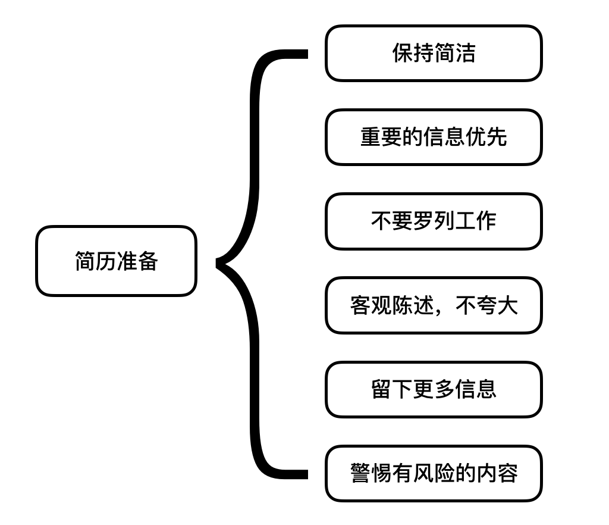
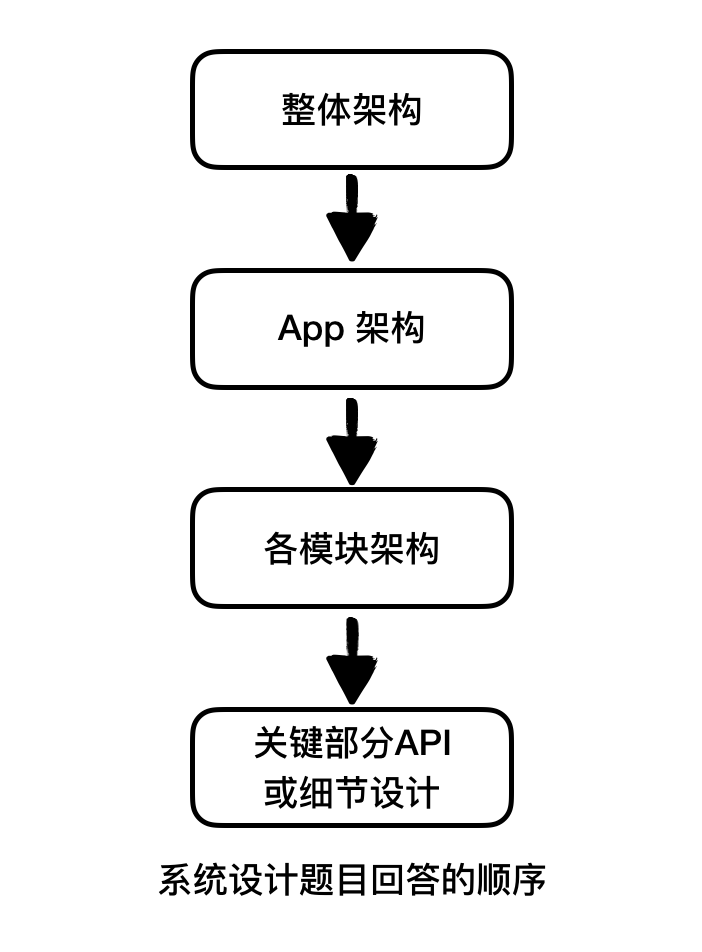

#  iOS 面试之道
故胤道长

唐巧

## 前言
智能手机经过十多年发展，其增长已经趋于平稳，技术也已经逐渐成熟，以苹果为代表的 iOS 应用已经融入了生活的方方面面。作为相关技术的开发者，唐巧老师和我，怀着忐忑的心情，将多年的经验和积累，结合具体面试内容，总结成了这本《iOS 面试之道》，呈现在各位读者面前。

《iOS 面试之道》分为三个部分，其中面试准备部分由唐巧老师创作，算法和 iOS 专业问答部分则是我完成。

第一个部分为面试的准备。这部分详谈了求职中遇到的基本问题，唐巧老师根据其多年的经验现身说法，在面试流程、简历投递、复习准备方面给出了完备的参考和建议。

第二部分为算法部分。作为对程序员基本功的考察，算法几乎是所有公司、各种水平的程序员都要面对的必考内容。该部分采用 Swift 语言重新审视了多种数据结构和算法原理，可以说是为 iOS 开发者量身打造的算法解答。

第三部分为 iOS 专业问答，分为语言工具、系统框架、经验之谈三个部分，采用问答的形式进行书写。语言工具章节主要针对 iOS 的主流开发语言 Objective-C 和 Swift 进行分析和对比，同时也整理了 Xcode 编辑器的使用技巧和经验。正所谓工欲善其事必先利其器，该章节主要考察的是开发者对自己手头工具和语言特性的掌握。系统框架章节则是从视图、网络、设计模式几个方面考察开发者的开发水准，这是任何一个合格的 iOS 开发者都应该具备的基本素养。最后一个章节是经验之谈，该章节是一些进阶内容的提问和解答，考察的是开发者功力的深厚。

本书收录和参考了大量的真实面试题，每章面试题的难度也按照从易到难的顺序进行编写。如果你是一名 iOS 开发者正准备跳槽，本书是一本不错的复习参考书目；对于没有面试计划的开发者，这本书也可以帮助你对知识进行提纲挈领的整理；对于 iOS 面试官，我们也希望这本书能够提供考察的依据和源泉；对于其他背景的工程师，若想一窥 iOS 世界的知识框架，本书也是一个不错的切入点。

感谢电子工业出版社的编辑王静，感谢对我们提出的大量宝贵意见。感谢唐巧老师在该书创作上的尽心尽力和对我的不吝指教。感谢喵神的作序和诸位同仁的推荐，他们的帮助使得这本书的价值能最大限度的展现给读者朋友。最后，我要感谢我的父母，感谢他们对我的支持和理解。

故胤道长
2018年6月1日于硅谷

### 第 1.1 章 推荐序
“你会翻转二叉树吗？不会？那对不起…”

当闻名遐迩，编写了几乎是业界标准的 Homebrew 的作者 Max Howell 在面试时被 Google 以算法题拒绝后，我不禁开始重新思考，面试为什么这么重要，面试里有没有什么能帮助我们遂愿的必杀技或者小窍门。Max Howell 是幸运的，因为他有着社区内无与伦比的声望和漂亮的项目履历，Google 将这扇门关上后，Apple 又为他开了一扇窗。但是，对于可能资质平平，也似乎没有什么特别的闪光点的自己，要怎么做才能寻求到一个自己心仪已久的职位，其实是件非常值得细细琢磨一番的事情。

面试几乎是每个社会人一生必然会经历几次的社会活动，但是由于它一般发生频次不高，很容易被人忽视。我自己在面试别人时，最大的感受就是有不少面试者其实并没有做好万全的准备。很多时候，候选人虽然可能十分优秀，但在面试时总感觉就差那么临门一脚：要么是因为面试礼仪不足让人觉得无法合作，要么是交流时过于紧张导致理解偏差，要么是做面试题目时由于缺乏经验，无法很快抓住问题本质。这往往就是准备不足，由于这样的原因导致面试失败没有拿到 offer 的话，就非常可惜了。

本书的两位作者分别是中美两国的知名大厂的高级从业人员，有丰富的面试（别人）的经验。他们合作编写了本书，想要解决的就是上面提到的问题。书中内容涵盖广泛：从顶层的面试前的职位调研、简历准备，到具体的算法设计、iOS 开发中的常见问题，再到最后的面试总结、offer 谈判及挑选，都有所涉足。在保证覆盖面的前提下，本书对一些重点进行了深入讲解：比如对常见算法给出了具体的参考实现，对常见的误用和考点进行了深入的原理分析。另外，本书中很多话题都带有关键字，通过查询书中的关键字，读者可以概览相关知识，并迅速建立起关于这个关键字的网络。作者结合自己的行业经验和对行业现状的分析，不单单向应聘者提出了问题，更一一详尽地给出了解决的方式和建议。可谓字字珠玑，相见恨晚。

通过阅读本书，你不仅可以对面试时的技巧和问题进行准备，也可以更多地了解 iOS 大厂的技术人员所关注和重视的技术点。因此即使你短期内不参加面试，也可以通过阅读本书开拓视野，并对自己的知识体系查缺补漏。这不仅会在你下次的面试中有所助力，也可以帮助你精进实力，在现在的工作中更加游刃有余。

好了，现在是时候来让我们看看两位作者会带给我们怎样的“思维碰撞”了。

王巍

## 第 2 章 面试策略
本章为面试的准备部分，这部分详谈了求职中遇到的基本问题，唐巧老师根据其多年的经验现身说法，在面试流程、简历投递、复习准备方面给出了完备的参考和建议。

### 第 2.1 章 简历的准备
在面试中，我发现很多人都不能写好一份求职简历，所以我们首先谈谈如何写一份针对互联网公司的求职简历。

1.简洁的艺术

互联网公司和传统企业有着很大的区别，通常情况下，创新和效率是互联网公司比较追求的公司文化，所以体现在简历上，就是超过一页的简历通常会被认为不够专业。

更麻烦的是，多数超过一页的简历很可能在 HR 手中就被过滤掉了。因为 HR 每天会收到大量的简历，一般情况下每份简历在手中的停留时间也就 10 秒钟左右。而超过一页的简历会需要更多的时间去寻找简历中的有价值部分，对于 HR 来说，她更倾向于认为这种人通常是不靠谱的，因为写个简历都不懂行规，为什么还要给他面试机会呢?

那么我们应该如何精简简历呢? 简单说来就是一个字：删！

删掉不必要的自我介绍信息。很多求职者会将自己在学校所学的课程罗列上去，例如：C 语言，数据结构，数学分析⋯⋯好家伙，一写就是几十门，还放在简历的最上面，就怕面试官看不见。对于这类信息，一个字：删！面试官不关心你上了哪些课程，而且在全中国，大家上的课程也都大同小异，所以没必要写出来。

删除不必要的工作或实习、实践经历。如果你找一份程序员的工作，那么你参加了奥运会的志愿者活动，并且拿到了奖励或者你参加学校的辩论队，获得了最佳辩手这些经历通常是不相关的。诸如此类的还有你帮导师代课，讲了和工作不相关的某某专业课，或者你在学生会工作等等。删除不相关的工作、实习或实践内容可以保证你的简历干净。当然，如果你实在没得可写，比如你是应届生，一点实习经历都没有，那可以适当写一两条，保证你能写够一页的简历，但是那两条也要注意是强调你的团队合作能力或者执行力之类的技能，因为这些才是面试官感兴趣的。

删除不必要的证书。最多写个 4、6 级的证书，什么教师资格证，中高级程序员证，还有国内的各种什么认证，都是没有人关心的。

删除不必要的细节。作为 iOS 开发的面试官，很多求职者在介绍自己的 iOS 项目经历的时候，介绍了这个工程用的工作环境是 Mac OS，使用的机器是 Mac Mini，编译器是 Xcode，能够运行在 iOS 什么版本的环境。还有一些人，把这个项目用到的开源库都写上啦，什么 AFNetworking, CocoaPods 啥的。这些其实都不是重点，请删掉。后面我会讲，你应该如何介绍你的 iOS 项目经历。

自我评价，这个部分是应届生最喜欢写的，各种有没有的优点都写上，例如：

性格开朗、稳重、有活力，待人热情、真诚；工作认真负责，积极主动，能吃苦耐劳，勇于承受压力，勇于创新；有很强的组织能力和团队协作精神，具有较强的适应能力；纪律性强，工作积极配合；意志坚强，具有较强的无私奉献精神。对待工作认真负责，善于沟通、协调有较强的组织能力与团队精神；活泼开朗、乐观上进、有爱心并善于施教并行；上进心强、勤于学习能不断提高自身的能力与综合素质。
这些内容在面试的时候不太好考查，都可以删掉。通常如果有 HR 面的话，HR 自然会考查一些你的沟通，抗压，性格等软实力。

我相信，不管你是刚毕业的学生，还是工作十年的老手，你都可以把你的简历精简到一页 A4 纸上。记住，简洁是一种美，一种效率，也是一种艺术。

2.重要的信息写在最前面

将你觉得最吸引人的地方写在最前面。如果你有牛逼公司的实习，那就把实习经历写在最前面，如果你在一个牛逼的实验室里面做科研，就把研究成果和论文写出来，如果你有获得过比较牛逼的比赛名次（例如 Google code jam, ACM 比赛之类），写上绝对吸引眼球。

所以，每个人的简历的介绍顺序应该都是不一样的，不要在网上下载一个模板，然后就一项一项地填：教育经历，实习经历，得奖经历，个人爱好，这样的简历毫无吸引力，也无法突出你的特点。

除了你的个人特点是重要信息外，你的手机号、邮箱、毕业院校、专业以及毕业时间这些也都是非常重要的，一定要写在简历最上面。

3.不要简单地罗列工作经历

不要简单地说你开发了某某 iOS 客户端。这样简单的罗列你的作品集并不能让面试官很好地了解你的能力，当然，真正在面试时面试官可能会仔细询问，但是一份好的简历，应该省去一些面试官额外询问你的工作细节的时间。

具体的做法是：详细的描述你对于某某 iOS 客户端的贡献。主要包括：你参与了多少比例功能的开发? 你解决了哪些开发中的有挑战的问题? 你是不是技术负责人?

而且，通过你反思这些贡献，你也可以达到自我审视，如果你发现这个项目你根本什么有价值的贡献都没做，就打了打酱油，那你最好不要写在简历上，否则当面试官在面试时问起时，你会很难回答，最终让他发现你的这个项目经历根本一文不值时，肯定会给一个负面的印象。

4.不要写任何虚假或夸大的信息

刚刚毕业的学生都喜欢写精通 Java，精通 C/C++，其实代码可能写了不到 1 万行。我觉得你要精通某个语言，至少得写 50 万行这个语言的代码才行，而且要对语言的各种内部机制和原理有了解。那些宣称精通 Java 的同学，连 Java 如何做内存回收，如何做泛型支持，如何做自动 boxing 和 unboxing 的都不知道，真不知道为什么要写精通二字。

任何夸大或虚假的信息，在面试时被发现，会造成极差的面试印象。所以你如果对某个知识一知半解，要么就写 “使用过” 某某，要么就干脆不写。如果你简历实在太单薄，没办法写上了一些自己打酱油的项目，被问起来怎么办? 请看看下面的故事：

我面试过一个同学，他在面试时非常诚实。我问他一些简历上的东西，他如果不会，就会老实说，这个我只是使用了一下，确实不清楚细节。对于一些没有技术含量的项目，他也会老实说，这个项目他做的工作比较少，主要是别人在做。最后他还会补充说，“我自认为自己数据结构和算法还不错，要不你问我这方面的知识吧。”
这倒是一个不错的办法，对于一个没有项目经验，但是聪明并且数据结构和算法基础知识扎实的应届生，其实我们是非常愿意培养的。很多人以为公司面试是看经验，希望招进来就能干活，其实不是的，至少我们现在以及我以前在网易招人，面试的是对方的潜力，潜力越大，可塑性好，未来进步得也更快；一些资质平庸，却经验稍微丰富一点的开发者，相比聪明好学的面试者，后劲是不足的。

总之，不要写任何虚假或夸大的信息，即使你最终骗得过面试官，进了某公司，如果能力不够，在最初的试用期内，也很可能因为能力不足而被开掉。

5.留下更多信息

刚刚说到，简历最好写够一张 A4 纸即可，那么你如果想留下更多可供面试官参考的信息怎么办呢？其实你可以附上更多的参考链接，这样如果面试官对你感兴趣，自然会仔细去查阅这些链接。对于 iOS 面试来说，GitHub 上面的开源项目地址、博客地址都是不错的参考信息。如果你在微博上也频繁讨论技术，也可以附上微博地址。

我特别建议大家如果有精力，可以好好维护一下自己的博客或者 GitHub 上的开源代码。因为如果你打算把这些写到简历上，让面试官去上面仔细评价你的水平，你就应该对上面的内容做到足够认真的准备。否则，本来面试完面试官还挺感兴趣的，结果一看你的博客和开源代码，评价立刻降低，就得不偿失了。

6.不要附加任何可能带来负面印象的信息

任何与招聘工作无关的东西，尽量不要提。有些信息提了可能有加分，也可能有减分，取决于具体的面试官。下面我罗列一下我认为是减分的信息。

1）个人照片

不要在简历中附加个人照片。个人长相属于与工作能力不相关的信息，也许你觉得你长得很帅，那你怎么知道你的样子不和面试官的情敌长得一样? 也许你长得很漂亮，那么你怎么知道 HR 是否被你长得一样的小三把男朋友抢了? 我说得有点极端，那人们对于长相的评价标准确实千差万别，萝卜青菜各有所爱，加上可能有一些潜在的极端情况，所以没必要附加这部分信息。这属于加了可能有加分，也可能有减分的情况。

2）有风险的爱好

不要写各种奇怪的爱好。喜欢打游戏、抽烟、喝酒，这类可能带来负面印象的爱好最好不要写。的确有些公司会有这种一起联机玩游戏或者喝酒的文化，不过除非你明确清楚对于目标公司，写上会是加分项，否则还是不写为妙。

3）使用 PDF 格式

不要使用 Word 格式的简历，要使用 PDF 的格式。我在招 iOS 程序员时，好多人的简历都是 Word 格式的，我都怀疑这些人是否有 Mac 电脑。因为 Mac 下的 office 那么难用，公司好多人机器上都没有 Mac 版 office。我真怀疑这些人真是的想投简历么? PDF 格式的简历通常能展现出简历的专业性。

4）QQ号码邮箱

不要使用 QQ 号开头的 QQ 邮箱，例如 12345@qq.com ，邮箱的事情我之前简单说过，有些人很在乎这个，有些人觉得无所谓，我个人对用数字开头的 QQ 邮箱的求职者不会有加分，但是对使用 Gmail 邮箱的求职者有加分。因为这涉及到个人的工作效率，使用 Gmail 的人通常会使用邮件组，过滤器，IMAP 协议，标签，这些都有助于提高工作效率。如果你非要使用 QQ 邮箱，也应该申请一个有意义的邮箱名，例如 tangqiaoboy@qq.com 。

7.职业培训信息

不要写参加过某某培训公司的 iOS 培训，特别是那种一、两个月的速成培训。这对于我和身边很多面试官来说，绝对是负分。

这个道理似乎有点奇怪，因为我们从小都是由老师教授新知识的。我自己也实验过，掌握同样的高中课本上的知识，自己自学的速度通常比老师讲授的速度要慢一倍的时间。即一个知识点，如果你自己要看 2 小时的书才能理解的话，有好的老师给你讲解的话，只需要一个小时就够了。所以，我一直希望在学习各种东西的时候都能去听一些课程，因为我认为这样节省了我学习的时间。

但是这个道理在程序员这个领域行不通，为什么这么说呢？原因有两点：

计算机编程相关的知识更新速度很快。同时，国内的 IT 类资料的翻译质量相当差，原创的优秀书籍也很少。所以，我们通常需要靠阅读英文才能掌握最新的资料。拿 iOS 来说，每年 WWDC 的资料都非常重要，而这些内容涉及版权，国内培训机构很难快速整理成教材。

计算机编程知识需要较多的专业知识积累和实践。学校的老师更多只能做入门性的教学工作。

如果一个培训机构有一个老师，他强到能够通过自己做一些项目来积累很多专业知识和实践，并且不断地从国外资料上学习最新的技术。那么这个人在企业里面会比在国内的培训机构更有施展自己能力的空间。国内的培训机构因为受众面的原因，基本上还是培养那种初级的程序员新手，所以对老师的新技术学习速度要求不会那么高，自然老师也不会花那么时间在新技术研究上。但是企业就不一样了，企业需要不停地利用新技术来增强自己的产品竞争力，所以对于 IT 企业来说，产品的竞争就是人才的竞争，所以给优秀的人能够开出很高的薪水。

所以，我们不能期望从 IT 类培训机构中学习到最新的技术，一切只能通过我们自学。当然，自学之后在同行之间相互交流，对于我们的技术成长也是很有用的。

小结

<!---->简历的准备

上图是本节讨论的总结，在简历准备上，我们需要考虑简历的简洁性等各种注意事项。

### 第 2.2 章 寻找机会
#### 1.寻找内推机会

其实，最好的面试机会都不是公开渠道的。好的机会都隐藏于各种内部推荐之中。通过内部推荐，你可以更加了解目标工作的团队和内容，另外内部推荐通常也可以跳过简历筛选环节，直接参加笔试或面试。我所在的猿辅导公司为内推设立了非常高的奖金激励，因为我们发现，综合各种渠道来看，内推的渠道的人才的简历质量最高，面试通过率最高的。

所以，如果你是学生，找找你在各大公司的师兄师姐内推；如果你已经工作了，你可以找前同事或者通过一些社交活动认识的技术同行内推。

大部分情况下，如果在目标公司你完全没有认识的人，你也可以找机会来认识几个。比如你可以通过微博、知乎、Twitter、GitHub 来结交新的朋友。然后双方聊天如果愉快的话，我相信内推这种举手之劳的事情对方不会拒绝的。

如果你都工作 5 年以上，还是没有建立足够好的社交圈子帮助你内推，那可能你需要做很多的社交活动交一些朋友。

#### 2.其它常见的渠道

内推之外，其它的公开招聘渠道通常都要差一些。现在也有一些专门针对互联网行业的招聘网站，例如拉勾、100offer 这类，它们也是不错的渠道，可以找到相关的招聘信息。

但因为这类公开渠道简历投放数量巨大，通常 HR 那边就会比较严格地筛选简历，拿我们公司来说，通常在这些渠道看 20 份简历，才会有 1 份愿意约面的简历。而且 HR 会只挑比较好的学校或者公司的候选人，也不排除还有例如笔试这种更多的面试流程。但是面试经验都是慢慢积累的，建议你也可以尝试这些渠道。

### 第 2.3 章 面试流程
##### 1.流程简述

就我所知，大部分的 iOS 公司的面试流程都大同小异。我们先简述一下大体的流程，然后再详细讨论。

在面试的刚开始，面试官通常会要求你做一个简短的自我介绍。然后面试官可能会和你聊聊你过去的实习项目或者工作内容。接着面试官可能会问你一些具体的技术问题，有经验的面试官会尽量找一些和你过去工作相关的技术问题。最后，有些公司会选择让你当场写写代码，Facebook 会让你在白板上写代码，国内的更多是让你在 A4 纸上写。有一些公司也会问一些系统设计方面的问题，考查你的整体架构能力。在面试快要结束时，通常面试官还会问你有没有别的什么问题。

以上这些流程，不同公司可能会跳过某些环节。比如有一些公司就不会考察当场在白板或 A4 纸上写代码。有些公司可能跳过问简历的环节直接写代码，特别是校园招聘的时候，因为应届生通常项目经验较少。面试流程图如下所示：

面试流程图

面试流程图

#### 2.自我介绍

自我介绍通常是面试中最简单、最好准备的环节。

一个好的自我介绍应该结合公司的招聘职位来做定制。比如公司有硬件的背景，就应该介绍一下在硬件上的经验或者兴趣；公司如果注重算法能力，则介绍自己的算法练习；公司如果注重团队合作，那么你介绍一下自己的社会活动都是可以的。

一个好的自我介绍应该提前写下来，并且背熟。因为候选人通常的紧张感都是来自于面试刚开始的几分钟，如果你刚开始的几分钟讲的结结巴巴，那么这种负面情绪会加剧你面试时的紧张感，从而影响你正常发挥。如果你提前把自我介绍准备得特别流利，那么开始几分钟的紧张感过去之后，你很可能就会很快进入状态，而忘记紧张这个事情了。

即使做到了以上这些仍然是不够的，候选者常见的问题还包括：

太简短
没有重点
太拖沓
不熟练
我们在展开讨论上面这些问题之前，我们可以站在面试官的立场考虑一下：如果你是面试官，你为什么要让候选人做自我介绍？你希望在自我介绍环节考察哪些信息？

在我看来，自我介绍环节相当重要，因为：

首先它考察了候选人的表达能力。大部分的程序员表达能力可能都一般，但是如果连自我介绍都说不清楚，通常就说明表达沟通能力稍微有点问题了。面试官通过这个环节可以初步考察到候选人的表达能力。
它同样也考察了候选人对于面试的重视程度。一般情况下，表达再差的程序员，也可以通过事先拟稿的方式，把自我介绍内容背下来。如果一个人自我介绍太差，说明他不但表达差，而且不重视这次面试。
最后，自我介绍对之后的面试环节起到了支撑作用。因为自我介绍中通常会涉及自己的项目经历，自己擅长的技术等。这些都很可能吸引面试官追问下去。好的候选人会通过自我介绍 “引导” 面试官问到自己擅长的领域知识。如果面试官最后对问题答案很满意，通过面试的几率就会大大增加。
所以我如果是面试官，我希望能得到一个清晰流畅的自我介绍。下面我们来看看候选人在面试中的常见问题。

1）太简短

一个好的自我介绍大概是 3～5 分钟。过短的自我介绍没法让面试官了解你的大致情况，也不足以看出来你的基本表达能力。

如果你发现自己没法说出足够时间的自我介绍。可以考虑在介绍中加入：自己的简单的求学经历，项目经历，项目中有亮点的地方，参与或研究过的一些开源项目，写过的博客，其它兴趣爱好，自己对新工作的期望和目标公司的理解。

我相信每个人经过准备，都可以做到一个 5 分钟长度的自我介绍。

2）没有重点

突破了时间的问题，接下来就需要掌握介绍的重点。通常一个技术面试，技术相关的介绍才是重点。所以求学经历，兴趣爱好之类的内容可以简单提到即可。

对于一个工作过的开发者，你过去做的项目哪个最有挑战，最能展示出你的水平其实自己应该是最清楚的。所以大家可以花时间把这个内容稍微强调一下。

当然你也没必要介绍得太细致，面试官如果感兴趣，自然会在之后的面试过程中和你讨论。

3）太拖沓

有些工作了几年的人，做过的项目差不多有个 3～5 个，面试的时候就忍不住一个一个说。单不说这么多项目在自我介绍环节不够介绍。就是之后的详细讨论环节，面试官也不可能讨论完你的所有项目经历。

所以千万不要做这种 “罗列经历” 的事情，你要做的就是挑一个或者最多两个项目，介绍一下项目大致的背景和你解决的主要问题即可。至于具体的解决过程，可以不必介绍。

4）不熟练

即便你的内容完全合适，时间长度完全合理，你也需要保证一个流利的陈述过程。适当在面试前多排练几次，所有人都可以做到一个流利的自我介绍。

还有一点非常神奇，就是一个人在做一件事情的时候，通常都是开始的前以及刚开始几分钟特别紧张。比如考试，演讲或者面试，通常这几分钟之后，人们进入 “状态” 了，就会忘记紧张了。

将自己的自我介绍背下来，可以保证一个流利顺畅的面试开局，这可以极大舒缓候选人的紧张情绪。相反，一开始自我介绍就结结巴巴，会加剧候选人的紧张情绪，而技术面试如果不能冷静的话，是很难在写代码环节保证逻辑清晰正确的。

所以，请大家务必把这个小环节重视起来，做出一个完美的开局。

#### 3.项目介绍

自我介绍之后，就轮到讨论更加具体的内容环节了，通常面试官都会根据自我介绍或者你的简历，选一个他感兴趣的项目来详细讨论。

这个时候，大家务必需要提前整理出自己参与的项目的具体挑战，以及自己做得比较好的地方。切忌不要说：“这个项目很简单，没什么挑战，那个项目也很简单，没什么好说的”。再简单的事情，都可以做到极致的，就看你有没有一个追求完美的心。

比如你的项目可能在你看来就是摆放几个 iOS 控件。但是，这些控件各自有什么使用上的技巧，有什么优化技巧？其实如果专心研究，还是有很多可以学习的。拿 UITableView 来说，一个人如果能够做到把它的滑动流程度优化好，是非常不容易的。这里面涉及网络资源的异步加载、图片资源的缓存、后台线程的渲染、CALayer 层的优化等等。

这其实也要求我们做工作要精益求精，不求甚解。所以一场成功的面试最最本质上，看得还是自己平时的积累。如果自己平时只是糊弄工作，那么面试时就很容易被看穿。

在这一点上，我奉劝大家在自己的简历上一定要老实。不要在建简历上弄虚作假，把自己没有做过的项目写在里面。

顺便我在这里也教一下大家如何面试别人。如果你是面试官，考察简历的真假最简单的方法就是问细节。一个项目的细节如果问得很深入，候选人有没有做过很容易可以看出来。

举个例子，如果候选人说他在某公司就职期间做了某某项目。你就可以问他：

这个工作具体的产品需求是什么样的？
大概做了多长时间？
整体的软件架构是什么样的？
涉及哪些人合作？几个开发和测试？
项目的时间排期是怎么定的？
你主要负责的部分和合作的人？
项目进行中有没有遇到什么问题？
这个项目最后最大的收获是什么？遗憾是什么？
项目最困难的一个需求是什么？具体什么实现的？
面试官如果做过类似项目，还可以问问通常这个项目常见的坑，看看候选人是什么解决的。

#### 4.写代码

编程能力，说到底还是一个实践的能力，所以说大部分公司都会考察当场写代码。我面试过上百人，见到过很多候选人在自我介绍和项目讨论时都滔滔不绝，侃侃而谈，感觉非常好。但是一到写代码环节就怂了，要么写出来各种逻辑问题和细节问题没处理好，要么就是根本写不出来。

由于人最终招进来就是干活写代码的，所以如果候选人当场写代码表现很差的话，基本上面试就挂掉了。

程序员这个行业，说到底就是一个翻译的工作，把产品经理的产品文档和设计师的 UI 设计，翻译成计算机能够理解的形式，这个形式通常就是一行一行的源码。

当面试官考察你写代码的时候，他其实在考察：

你对语言的熟悉程度。如果候选人连常见的变量定义和系统函数都不熟悉，说明他肯定经验还是非常欠缺。
你对逻辑的处理能力。产品经理关注的是用户场景和核心需求，而程序员关注的是逻辑边界和异常情况。程序的 bug 往往就是边界和特殊情况没有处理好。虽然说写出没有 bug 的程序几乎不可能，但是逻辑清晰的程序员能够把思路理清楚，减少 bug 发生的概率。
设计和架构能力。好的代码需要保证易于维护和修改。这里面涉及很多知识，从简单的 “单一职责” 原则，到复杂的 “好的组合优于继承” 原则，其中设计模式相关的知识最多。写代码的时候多少还是能够看出这方面的能力。另外有些公司，例如 Facebook，会有专门的系统设计（System Design）面试环节，专注于考察设计能力。
#### 5.系统设计

有一些公司喜欢考查一些系统设计的问题，简单来说，就是让你解决一个具体的业务需求，看看你是否能够将业务逻辑梳理清楚，并且拆解成各个模块，设计好模块间的关系。举几个例子，面试官可能让你：

设计一个类似微博的信息流应用。
设计一个本地数据缓存架构。
设计一个埋点分析系统。
设计一个直播答题系统。
设计一个多端的数据同步系统。
设计一个动态补丁的方案。
这些系统的设计都非常考查一个人知识的全面性。通常情况下，如果一个人只知道 iOS 开发的知识，是很难做出相关的设计的。为了能够解决这些系统设计题，我们首先需要有足够的知识面，适度了解一下 Android 端、Web 端以及服务器端的各种技术方案背后的原理。你可以不写别的平台的代码，但是一定要理解它们在技术上能做到什么，不能做到什么。你也不必过于担心，面试官在考查的时候，还是会重点考查 iOS 相关的部分。

我们将在下一小节，展开讨论如何准备和回答系统设计题。

#### 6.提问

提问环节通常在面试结束前，取决于前面的部分是否按时结束，有些时候前面的环节占用了太多时间，也可能没有提问环节了。在后面的章节，我们会展开讨论一下如何提问。

### 第 2.4 章 代码考查和系统设计的准备
#### 1.如何准备代码考查

很多面试的能力都不是突击可以获得的。项目经历不是，代码能力也不是。如果说项目经历的获取还需要环境支持的话，代码能力的提高基本只需要自己投入就可以了。

在网上有很多练习编程的网站，特别是像面向求职者的 LeetCode 一类的网站，提供了各大公司的代码考察题目，并且大部分题目还有标准解答和示意代码。你可以在上面一遍一遍地练习，以提高自己的代码转换能力和逻辑思维能力。我建议大家至少做 100 道 LeetCode 里面 Facebook、Apple 这些大公司的代码题目，很多题目都设计得非常好，既是很好的练习题，又可能在实际工作中用到。Google 的面试题通常还要更难一些，对自己要求更高的同学也可以挑战一下。

我曾经面试过一个清华的应届生，考查他各种面试题目都解决得非常快，我就好奇他是怎么做到的。他回答说：他花了一年时间，把 LeetCode 上面的所有题目做了三遍。当时 LeetCode 上面大概有 700 道题目。你看，即使是清华这样厉害学校的学生，同样在代码练习量上非常努力。我自己觉得，这个应届生在努力程度上，就可以超过 95% 的别的候选人了。

如果是非科班的学生，在写代码前你还需要学习数据结构和基本的算法知识。相关的学习资料可以选择国外的公开课，或者国内 985 大学计算机专业的教材。麦克道尔著的《程序员面试金典》也是非常不错的学习资料。

除此之外，在纸或白板上写代码的能力也需要好好练习。纸上写代码麻烦的地方在于不方便及时涂改，所以需要思考得比较清楚再动手写。准备一些 A4 纸，然后拿 LeetCode 题目多练习几次，慢慢就会有感觉。

我自己在纸上写代码的经验来着早年在大学时参加的 ACM 国际大学生程序设计竞赛，这是一个 3 人组队参加的比赛。比赛时 3 个人可以合作答题，但是只有一台电脑可以使用。所以为了最大限度地提高电脑的利用率，我们同时做 3 道题，然后会现在纸上写代码，等自己在纸上完成代码的编写后，再使用电脑来录入和调试。为了备战 ACM 比赛，我差不多有几百道在纸上手写代码的经验。

我最后总结出来在纸上写代码的要诀是：一定要先把整体逻辑框架梳理清楚，然后再填充细节。所以你可以用文字、流程图或任何你喜欢的方式先把代码整体逻辑描述在纸上，然后检查没有边界问题后，再在纸上细化成具体的代码。

#### 2.写代码之外的沟通

即使是做代码题目，必要的沟通交流也是必须的。我见过很多候选人听完题目就埋头写代码，完全不和面试官交流，这其实是非常错误得做法。如果写代码完全不需要交流，那么为什么不当做笔试题，而要耽误面试官的时间坐在你旁边？难道就只是为了监督吗？

其实，解决一道代码题目的思考过程是非常有价值的，面试官问你一道代码题目，其实是希望和你一起沟通交流，了解你的思路，帮助你找到最好的解法，最后才是把代码完成的事情。

所以，当面试官给你一道题目，你首先要做的是和面试官足够地交流。你可以首先确保你完整地理解了题意，这可以通过询问题目的一些细节来达到，比如问输入的数据范围，输出的具体要求，一些异常的情况是否要考虑等等。

等你完全理解题意之后，下一步就是将你的想法说出来。你完全不必担心没有一下子说出最好、最完美的解法，大部分好的代码题目都可以一题多解，你可以先说一个最简单直接的方法，然后说出这种方法的时间复杂度、空间复杂度。一般面试官都会问你有没有更好的做法，或者你也可以直接说想思考有没有更好的做法。接着你可以试试看能不能想出一些办法，即使一些办法没有完全想清楚所有细节，也可以说出来。好的面试官如果发现你的方法完全方向不对，还可以及时干预。

你如果在思路上有卡住，你甚至可以请求面试官给你一些 “提示”。虽然这可能使得你面试表现稍微减分，但是比起完全没有写出代码来说也要好很多。

除了写代码之前和面试官交流、确认解法，写完代码之后，你也需要和面试官讨论你的代码细节问题。通常代码中多多少少会出现一些问题，面试官会给你一些引导，帮助你发现并且修改有问题的代码。

#### 3.如何准备系统设计

如果你是一个应届生，通常考查的系统设计题都不太难，你只需要有一些系统设计的基础，都不至于完全答不上来。在准备资料上，可以看看《设计模式》相关的书。如果有机会实习，可以多尝试一些不同的职位，如果你同时尝试过客户端和服务器端开发，在系统设计上就可以更加综合考虑设计方案在多端的实现难度，以便做出权衡。

另外，你可以通过学习分析一些开源项目的代码，来学习架构设计。在网上，你通常也可以搜索到一些常见的系统设计题目，在本书的上一节中，我也提供了好多系统设计题。把这些系统设计题目仔细研究，尝试自己实现一下，通过实践并且和同学讨论，相信你也会有不错的成长。

系统设计题目通常都不会有特别标准的解答，其实考查过程更看重一个人分析解决问题的思路。这样的思路可以保证即使未来遇到没有见过的问题，也可以从容地系统性思考和判断。所以，你需要给面试官展现你思考的过程。在面试中，了解需求细节，解释设计思路，讨论和判断一个设计的优缺点，都能够让面试官体会到你这方面的素质。

虽然没有标准的答案，但是系统设计还是有一些解题套路，下面我就给大家介绍一下。

首先系统设计题都非常考查一个人知识的全面性。所以大家应该平时多了解一些 iOS 之外的技术，比如适度了解一下 Android 端、Web 端以及服务器端的各种技术方案背后的原理。你可以不写别的平台的代码，但是一定要理解它们在技术上能做到什么，不能做到什么。你也不必过于担心，面试官在考查的时候，还是会重点考查 iOS 相关的部分。

在知识足够宽泛的情况下，你需要首先和面试官明确问题的各种细节，比如假如题目是“设计一个类似微博的信息流应用”，你需要了解清楚这个信息流应用更多的技术要求，比如：

信息流的内容是否包括图片，文字，语音。
平均每个用户每天有多少的信息流更新量。
是否需要做图文混排。
是否需要做图片的缓存，历史信息的缓存。
断网情况下是否需要显示离线内容。
发送失败情况下是否需要暂存内容。
系统对核心功能的性能（例如发送，刷新）的要求是多少。
有一些技术细节可能是面试官想考查的，你问的时候他就会要求多一些；有一些技术方案明显很复杂的，你提出来，他即使不考查你，也会觉得你的考虑是足够周全的。

在确定技术细节要求后，你就可以开始讲你的系统架构设计了，这个时候讲的要诀是先框架，再细节。你需要先把各个模块的层次画出来，比如刚刚那道题目，你先介绍一下整体 App 是怎么和服务器通讯的，服务器端的信息流大概是如何存储的，然后你就需要详细介绍 App 的部分。

在介绍 App 的框架时，先画出 Model 层，Controller 层，View 层。然后再进一步细化，比如把 Model 层细化到本地存储，图片缓存，网络请求等模块。View 层如何处理图文混排，Controller 层如何与其它层通讯。

当框架介绍得差不多的时候，你需要把后续的选择交给面试官。面试官可能会选其中某一个模块，让你做更细一步的设计。比如让你设计网络通讯的 RESTful 接口，细化缓存相关的 API 名字。面试官甚至可能选一两个具体的函数，让你写写。面试官也可能进一步挑战你的一些设计细节，这个过程中，你可能需要修正自己的设计，也可能需要解释你的设计。

下图就是回答系统设计题的框架。

系统设计题的框架

一道系统设计题的考查方式可以千变万化，需要的是你和面试官之间密切地交流，性格内向的程序员很可能在这方面吃亏。所以，除了有方泛的知识面以及扎实的架构设计基本功外，多和面试官讨论交流也是面试过程中的关键因素。

#### 5.复盘

复盘是一个人持续提高和进步的源泉。也许你觉得你的面试表现很好，但是为什么面试没有通过呢？当你被拒的时候，与其抱怨面试官或者面试流程不公正，倒不如静下心来想一想，看看是不是自己忽视了某些细节或者关键点。如下图所示：

例如，当你的算法或系统设计题解决方案不太好时，面试官通常不会直接纠正你，他只会稍微引导一下。面试结束后，他更不可能给你做教学，教你应该怎么做答这些题目。所以，你的解决方案好不好，你其实只是凭感觉来的。你可能觉得你已经解决了这个问题，但是面试官可能心里想，这个解决方案虽然可以工作，但是是他见到过的最最愚蠢低效的办法。

所有的这一切，你都无法直接知晓。你只能在面试之后，特别是被拒之后，仔细复盘分析一下，看看自己可能哪些问题回答得不好。这个时候，找人请教和讨论也显得特别重要，你可以把你怀疑的一些面试糟糕表现描述出来，然后找人一起分析一下，通常情况下都会有一些收获的。

除了复盘算法和系统设计题，也需要复盘一下自己整体的面试流程是否表现正常。例如：

我的自我介绍是否流利？
我的项目沟通是否介绍清楚了？
面试官有没有完全理解我介绍的项目挑战？
我的时间控制是否到位？
我有没有迟到，中途接电话，或者任何被认为不礼貌的行为？
我做得不好的地方，有没有短期可以改善的？
我做得不好的地方，短期不能改善的，我能不能用别的方式适当弥补？比如面试中强调自己的强项。
每次面试后，做一个小结，可以使得自己每次都会有一点点进步，几十场面试下来，相信大家都会有不小的成长。

### 第 2.5 章 如何提问
有些时候前面的环节占用了太多的时间，面试官可能就不会给你提问的机会。但如果面试官说：“我的问题问完了，你有什么问题吗？” 那么恭喜你，你基本上已经完成了整个面试，而且还有一点时间可以交流一下。通常这个提问环节留给双方的时间不会特别多，所以可以就你关心的问题来提一到两个问题即可。

很多候选人会说：“我没有什么问题”。这是可以的，但是这个环节最好还是提个问题稍好一点，它能够显示出你对目标公司的关注和兴趣。提问的内容可以围绕着技术氛围、技术分享、公司的业务、未来的方向等等。比如：

公司在 iOS 端主要使用了哪些技术框架？
公司内部有技术分享或者别的学习交流机会吗？
公司当前团队有多大，希望我进去参与哪方面的业务？
公司当前有没有什么大的竞争对手？
未来公司希望在哪些产品上重点发力？
但是切忌不要问以下这些问题，否则会显得自己很不专业。

#### 1.询问面试表现

很多人在面试结束后，都忍不住问：“我刚刚的面试表现怎么样？”面试官通常都不会当面评价候选人，因为这可能引起冲突。大部分候选人都不能冷静地面对面试批评。而即使你面试表现很好，是否录用也取决于你的竞争者的表现是否在你之上，所以面试官真的很难回答这个问题。

通常如果你问了这个问题，面试官要么糊弄地回答：“还不错”，要么就诚恳地回答：“我们通常不当面反馈面试表现”。

#### 2.询问面试题答案

有人会在面试结束前问：“刚刚那道题目应该怎么做？”面试官听到这种问题通常只能苦笑一下。你要知道，这是面试，不是面试培训。面试官没有义务给你解答题目，而且通常为了保证面试题目资源的保密，面试官也不愿意把一道题目的最优解告诉你。如果你回去告诉了你的朋友，这道题目就没有考察的功能了。

如果你特别想知道面试题答案，还是应该自己在面试结束后仔细钻研。大部分公司也会要求候选人对面试题保密，所以如果你把题目放到网上共享，通常也是不被允许的，严重的情况下，可能造成通过的面试 offer 因此被取消。

#### 3.询问薪资

大部分公司的薪资都是非常保密的，能知道薪资的人除了 HR 外，只有很高级的主管才有可能知道。大部分的面试官可能都不知道你的职位薪资。所以如果你有这方面的需求，应该直接找 HR 咨询，而不应该问面试官。

一般你的最后一轮面试官有可能是你未来的主管，他可能会询问你的薪资和期望，遇到这种情况，你可以趁机反馈出自己的意愿，但如果面试官没有提，最好你也就不要问这方面的信息，以免面试官拒绝回答造成自己过于尴尬。

#### 小结

整体来说，面试的打分和提问环节相关性不大，所以大家只要别问敏感问题即可。

### 第 2.6 章 offer的比较和选择
恭喜你！经过努力，你最后拿到了好几家公司的 offer！这些公司有的规模很小，是成立不久的创业公司；有的已经是纳斯达克的上市公司，员工数量过万；有的是外企，有着复杂但是规范的流程；有的是国企事业单位，工资虽然不太高但是福利好并且工作压力不大。你该如何选择？

很多人都会纠结，我也曾经纠结过。现在回过头来，我觉得要做好选择，核心还是对自己的情况有一个清晰的判断。每个人不一样，所以最后的选择也不一定一样。

#### 1.工作 vs 生活

这辈子打算怎么过，其实很多人都没有想得特别清楚明白。每个人的选择没有什么高低贵贱之分。也许你希望新工作能够尽量兼顾工作与生活，也许你希望新工作能够帮助自己快速在职业上成长。生活的目标不一样，答案也就不一样。想清楚了，答案就明显了很多。

如果你希望尽量兼顾工作与生活，那么那些工作强度大的 offer 自然应该就排在低优先级。哪些公司工作强度大？询问一下对方公司的 HR 或者面试官，平常的上下班时间，加班的频率，通常都可以得到比较客观的回答。如果你恰好有在目标公司上班的朋友，那么你应该可以获得更多这方面的信息。你也可以在网上搜索相关的关键词，获得信息。

其实在很多国家，人们并不是那么看重工作的，很多人更多的看重生活以及家庭。只是国内的环境以及我们从小的教育，使得我们很看重工作，以及工作的职业成长。

#### 2.职业成长

大部分人看重职业成长，这一点非常好理解：程序员是一个需要持续学习和积累的工作，如果不能在工作中持续学习成长，几年之后如何在职场获得立足之地呢？但追求快速的职业成长不一定表示一定要去工作强度特别大的公司，其实核心还是看：

工作的内容
指导你的导师（我们行业内常常叫 Mentor）
一个有职业成长的 offer，其工作内容应该可以让你建立起对相关专业领域的完整知识，并且该工作内容很可能具有成长性和发展性。比如，如果是偏研究的工作，基于深度学习的研究就比别的人工智能研究更加具有成长性。又如，做用户产品就比做内部系统更具有成长性。

如果你的 offer 是去维护一个已经开发了 10 多年的老旧系统，除非是要你花大力气重构它，否则你的工作成长性也会较差，因为难的问题都已经被别人早解决过了。

行业的成长也很重要，比如互联网行业就比传统的软件行业好，移动互联网行业又比传统互联网行业好。选了一个好的行业，你的能力和待遇会随着行业的发展而发展。选错了一个行业，即使你做到这个行业的冠军，整个行业不挣钱，你的日子也不会好过。

除了工作本身的吸引力外，指导你的导师也很重要。一个领域的知识架构是什么样的，重要的观点和讨论，都是一个好的导师能够指引的。当然，你不要抱有什么事情都是导师手把手教这种幻想，这在公司里面既不现实，也不利于你自学能力的发展。

#### 3.职业背景

有一些人，特别是学校不太好的人，会特别看重第一份工作的公司背景。因为大部分公司在挑选简历的时候，差不多主要就看两条：毕业院校和工作过的公司。所以，我建议学校不太好的同学，可以在考虑 offer 的时候选择名气比较大的公司。这样对你未来的简历，会有一定的加分效果。

但如果你已经是非常好的学校（比如 985、211 院校）的毕业生了，那么我建议你不用太考虑公司的名气。因为对于你来说，学校背景这一条已经够你用作未来面试的敲门砖了。

#### 4.薪资的考虑

通常情况下，你的薪资是符合市场上相同工作年限的薪资范围的。在薪资范围内，你能拿到多少取决于新公司的内部薪资标准、你的面试表现，以及你以前的工作经历。

大部分人的直觉想法都是：「谁给的钱多去谁那儿」，但是我建议大家也综合考虑上面提到的职业成长以及公司的背景。如果一个工作没有职业成长性，那么给得钱再多，我也不建议大家去。

应届生的薪资通常都是不能谈的，但是非应届生因为每个候选人情况都不一样，很可能可以谈。

#### 5.考虑创业公司

如果你的学校背景特别好，又在比较好的大公司实习过，那么如果有一些上升期的创业公司，其实也是不错的选择。

首先，在这些创业公司里面，你可能获得更多的锻炼机会。然后，你的学校背景和实习经历，使得你即使换工作，也不会因为在创业公司很受影响。最后，也是最重要的是，如果这家公司最终上市，你有可能因此获得极大的期权回报。

#### 6.讨论与决策

以上我提供了一个基于工作和生活侧重点不同的考虑方式，考虑到每个人自身的具体情况，其实你还可以有别的考虑方式。比如有一些人可能父母身体不好，希望更多的离家近；又可能有一些人身体不太好，不希望太累。在你有了你的一套考虑逻辑以及结论之后，我还是建议你找你欣赏的人讨论商量一下，分享一下你的决策思路，也听听他的意见是什么。这些人可能是你的同学，朋友或者是导师，长辈。

一个好的决策应该是充分收集信息，并且独立决策的。所以你和少数人的讨论过程，有助于进一步判断你的思路是否有漏洞。一个人的 offer 还是会影响他好几年的职业生涯，所以在这个阶段多收集信息，多思考是非常必要的。但是我们也要切忌人云亦云地做决策，一定要自己独立的做判断，不要简单的盲从权威或者大众，因为没有任何人比你自己掌握的信息更多。

#### 7.反馈

在你做完决定之后，你就需要给公司反馈你的结果了。对于拒绝的 offer，你应该礼貌地表示歉意，并且希望以后可以保持联络。谁知道你未来会不会再次考虑他们的 offer 呢？

对于你接受的 offer，你应该更加积极地获取更多的信息。比如看看能否有机会和未来的团队 Leader 见面，了解一下未来工作可能用到的技术栈，提前体验一下公司的产品或者做一些相关技术上的学习。这些都可以帮助你更好更快地融入新的公司和团队。

#### 8.心态的调整

鱼和熊掌不可兼得。很多同学可能在 offer 选择的时候患得患失，最后即使做了决定，也会有后悔的时候。我想说大家还是应该调整好心态，没有哪个公司是完美的，在我们 IT 行业，也很少有人在一个公司待一辈子。所以调整好心态，决定了 offer 之后，就把该放的放下，努力把自己的思想放在未来的工作本身上。因为只有自己的能力提升了，才可能有更大的职业成长空间。

#### 小结

总结一下，你首先要对自己的未来生活有一个规划，是更偏重于家庭和生活，还是更偏重于工作。

然后，如果你希望偏重于工作，那么你需要考虑：职业成长性、职业背景、薪资。如果你特别优秀，我也建议你考虑一下创业公司的机会。

最后，你的决策过程应该和重要的人讨论，但是决策本身仍然应该由你自己做出。做出决策后，你应该礼貌地拒绝掉不接受的offer，然后对于接受的offer，做进一步的信息沟通和入职准备。

### 剩下的部分 总结
算法、Swift和OC的比较、框架、并发、架构

### 第3章 算法基础
#### 3.1 基本数据结构
#### 3.2 链表
#### 3.3 栈和队列
#### 3.4 二叉树
#### 3.4 排序和搜索
#### 3.5 深度优先和广度优先
#### 3.6 动态规划

### 第4章 语言工具
#### 4.1 Swift
#### 4.2 Objective-C
#### 4.3 Swift vs. Objective-C
#### 4.4 Xcode使用

### 第5章 系统框架
#### 5.1 UIKit
#### 5.2 UIScrollView及其子类
#### 5.3 网络、推送与数据处理
#### 5.4 并发编程
#### 5.5 设计模式

### 第6章 经验之谈
#### 6.1 架构的选择
#### 6.2 面向协议的编程
#### 6.3 App的测试和上架

### 第7章 结语

### 其他链接
[iOS 面试之道 阅读笔记（1）](https://www.jianshu.com/p/49cf5c3c48f4)  
[《iOS面试之道》读书笔记 - NSRunLoop](https://www.jianshu.com/p/4edcb2ab18d4)  
